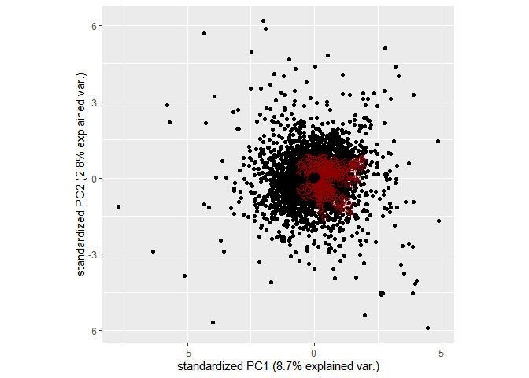

# Question 3

With the code, I can confirm that there are 92 PCA. This number is a
large, however, there are 92 unique tickets in the Top40.This is because
every year, some stocks get dropped form the Top40, while others get
added. Each of the 92 components explains a percentage of the total
variation in the T40 returns. That is, PC1 explains 8 % of the total
variance, which is the most out of the 92 PCA’s. PC50 to PC92 all
explain less than 1 percent of the total variance. The table below plots
the individuals components importance.

``` r
rm(list = ls()) # Clean your environment:
gc() 
```

    ##          used (Mb) gc trigger (Mb) max used (Mb)
    ## Ncells 395473 21.2     810452 43.3   638940 34.2
    ## Vcells 715025  5.5    8388608 64.0  1633464 12.5

``` r
library(tidyverse)
```

    ## -- Attaching packages --------------------------------------- tidyverse 1.3.1 --

    ## v ggplot2 3.3.3     v purrr   0.3.4
    ## v tibble  3.1.3     v dplyr   1.0.7
    ## v tidyr   1.1.4     v stringr 1.4.0
    ## v readr   2.0.2     v forcats 0.5.1

    ## -- Conflicts ------------------------------------------ tidyverse_conflicts() --
    ## x dplyr::filter() masks stats::filter()
    ## x dplyr::lag()    masks stats::lag()

``` r
library(dplyr)
library(rportfolios)
```

    ## Loading required package: truncdist

    ## Loading required package: stats4

    ## Loading required package: evd

``` r
library(PerformanceAnalytics)
```

    ## Loading required package: xts

    ## Loading required package: zoo

    ## 
    ## Attaching package: 'zoo'

    ## The following objects are masked from 'package:base':
    ## 
    ##     as.Date, as.Date.numeric

    ## 
    ## Attaching package: 'xts'

    ## The following objects are masked from 'package:dplyr':
    ## 
    ##     first, last

    ## 
    ## Attaching package: 'PerformanceAnalytics'

    ## The following object is masked from 'package:graphics':
    ## 
    ##     legend

``` r
library(devtools)
```

    ## Loading required package: usethis

``` r
library(rmsfuns)
if (!require(FactoMineR)) install.packages("FactoMineR")
```

    ## Loading required package: FactoMineR

``` r
if (!require(factoextra)) install.packages("factoextra")
```

    ## Loading required package: factoextra

    ## Welcome! Want to learn more? See two factoextra-related books at https://goo.gl/ve3WBa

``` r
library(factoextra)
library(FactoMineR)
pacman::p_install_gh("Nicktz/fmxdat")
```

    ## Skipping install of 'fmxdat' from a github remote, the SHA1 (be8e46c2) has not changed since last install.
    ##   Use `force = TRUE` to force installation

    ## 
    ## The following packages were installed:
    ## fmxdat

``` r
pacman::p_load(fEcofin)
list.files('code/', full.names = T, recursive = T) %>% .[grepl('.R', .)] %>% as.list() %>% walk(~source(.))
```

``` r
#Calculating returns
T40 <- read_rds("data/T40.rds")

T40[sapply(T40, is.infinite)] <- NA
T40[T40 == 0] <- NA
    
T40 <- read_rds("data/T40.rds") %>% na.locf(.,na.rm=T, 5) %>%
    select(date, Tickers, Return, J200) %>%
    mutate(Return = Return*J200) %>%
    select(date, Tickers, Return) %>% 
    group_by(Tickers) %>%
    mutate(Tickers = gsub(" SJ Equity", "", Tickers))

return_mat <- T40 %>% spread(Tickers,Return) 
colSums(is.na(T40))
```

    ##    date Tickers  Return 
    ##       0       0       0

``` r
impute_missing_returns <- function(return_mat, impute_returns_method = "NONE", Seed = 1234){
  # Make sure we have a date column called date:
  if( !"date" %in% colnames(return_mat) ) stop("No 'date' column provided in return_mat. Try again please.")

  # Note my use of 'any' below...
  # Also note that I 'return' return_mat - which stops the function and returns return_mat. 
  if( impute_returns_method %in% c("NONE", "None", "none") ) {
    if( any(is.na(return_mat)) ) warning("There are missing values in the return matrix.. Consider maybe using impute_returns_method = 'Drawn_Distribution_Own' / 'Drawn_Distribution_Collective'")
    return(return_mat)
  }

  
  if( impute_returns_method  == "Average") {

    return_mat <-
      return_mat %>% gather(Stocks, Returns, -date) %>%
      group_by(date) %>%
      mutate(Avg = mean(Returns, na.rm=T)) %>%
      mutate(Avg = coalesce(Avg, 0)) %>% # date with no returns - set avg to zero
      ungroup() %>%
      mutate(Returns = coalesce(Returns, Avg)) %>% select(-Avg) %>% spread(Stocks, Returns)

    # That is just so much easier when tidy right? See how I gathered and spread again to give back a wide df?
    
  } else

    if( impute_returns_method  == "Drawn_Distribution_Own") {

      set.seed(Seed)
      N <- nrow(return_mat)
      return_mat <-

        left_join(return_mat %>% gather(Stocks, Returns, -date),
                  return_mat %>% gather(Stocks, Returns, -date) %>% group_by(Stocks) %>%
                    do(Dens = density(.$Returns, na.rm=T)) %>%
                    ungroup() %>% group_by(Stocks) %>% # done to avoid warning.
                    do(Random_Draws = sample(.$Dens[[1]]$x, N, replace = TRUE, prob=.$Dens[[1]]$y)),
                  by = "Stocks"
        ) %>%  group_by(Stocks) %>% mutate(Row = row_number()) %>% mutate(Returns = coalesce(Returns, Random_Draws[[1]][Row])) %>%
        select(-Random_Draws, -Row) %>% ungroup() %>% spread(Stocks, Returns)

    } else

      if( impute_returns_method  == "Drawn_Distribution_Collective") {

        set.seed(Seed)
        NAll <- nrow(return_mat %>% gather(Stocks, Returns, -date))

        return_mat <-
          bind_cols(
          return_mat %>% gather(Stocks, Returns, -date),
          return_mat %>% gather(Stocks, Returns, -date) %>%
            do(Dens = density(.$Returns, na.rm=T)) %>%
            do(Random_Draws = sample(.$Dens[[1]]$x, NAll, replace = TRUE, prob=.$Dens[[1]]$y)) %>% unnest(Random_Draws)
          ) %>%
          mutate(Returns = coalesce(Returns, Random_Draws)) %>% select(-Random_Draws) %>% spread(Stocks, Returns)

      } else

        if( impute_returns_method  == "Zero") {
        warning("This is probably not the best idea but who am I to judge....")
          return_mat[is.na(return_mat)] <- 0

        } else
          stop("Please provide a valid impute_returns_method method. Options include:\n'Average', 'Drawn_Distribution_Own', 'Drawn_Distribution_Collective' and 'Zero'.")
}


options(scipen = 999) # Stop the scientific notation of

return_mat <- impute_missing_returns(return_mat, impute_returns_method = "Drawn_Distribution_Collective", Seed = as.numeric(format( Sys.time(), "%Y%d%H%M")))

return_mat_Nodate <- data.matrix(return_mat[, -1])

# Simple Sample covariance and mean:
Sigma <- RiskPortfolios::covEstimation(return_mat_Nodate)
Mu <- RiskPortfolios::meanEstimation(return_mat_Nodate)

#PCA calculations
pca <- prcomp(return_mat_Nodate,center=TRUE, scale.=TRUE)
d <- str(pca)
```

    ## List of 5
    ##  $ sdev    : num [1:92] 2.83 1.61 1.3 1.26 1.14 ...
    ##  $ rotation: num [1:92, 1:92] 0.2593 0.0253 0.0177 0.211 0.1262 ...
    ##   ..- attr(*, "dimnames")=List of 2
    ##   .. ..$ : chr [1:92] "ABG" "ACL" "AEG" "AGL" ...
    ##   .. ..$ : chr [1:92] "PC1" "PC2" "PC3" "PC4" ...
    ##  $ center  : Named num [1:92] 0.00000431 0.00001404 0.00000599 0.00001858 -0.00000232 ...
    ##   ..- attr(*, "names")= chr [1:92] "ABG" "ACL" "AEG" "AGL" ...
    ##  $ scale   : Named num [1:92] 0.000281 0.000812 0.000787 0.002478 0.000566 ...
    ##   ..- attr(*, "names")= chr [1:92] "ABG" "ACL" "AEG" "AGL" ...
    ##  $ x       : num [1:3458, 1:92] 3.73 -1.41 -1.65 -2.55 2.88 ...
    ##   ..- attr(*, "dimnames")=List of 2
    ##   .. ..$ : NULL
    ##   .. ..$ : chr [1:92] "PC1" "PC2" "PC3" "PC4" ...
    ##  - attr(*, "class")= chr "prcomp"

``` r
c <- pca$sdev #extracting standard deviation.
eigenvalues <- pca$sdev^2
b<- pca$rotation
a <- summary(pca)
a
```

    ## Importance of components:
    ##                            PC1     PC2    PC3     PC4     PC5     PC6     PC7
    ## Standard deviation     2.82995 1.61462 1.3012 1.25583 1.14199 1.12190 1.11551
    ## Proportion of Variance 0.08705 0.02834 0.0184 0.01714 0.01418 0.01368 0.01353
    ## Cumulative Proportion  0.08705 0.11539 0.1338 0.15093 0.16511 0.17879 0.19231
    ##                            PC8     PC9    PC10    PC11    PC12    PC13   PC14
    ## Standard deviation     1.11366 1.09950 1.09461 1.08973 1.08613 1.08340 1.0765
    ## Proportion of Variance 0.01348 0.01314 0.01302 0.01291 0.01282 0.01276 0.0126
    ## Cumulative Proportion  0.20579 0.21894 0.23196 0.24487 0.25769 0.27045 0.2830
    ##                           PC15    PC16    PC17    PC18    PC19    PC20    PC21
    ## Standard deviation     1.07215 1.07006 1.06698 1.06418 1.06052 1.05262 1.04896
    ## Proportion of Variance 0.01249 0.01245 0.01237 0.01231 0.01222 0.01204 0.01196
    ## Cumulative Proportion  0.29554 0.30798 0.32036 0.33267 0.34489 0.35694 0.36890
    ##                           PC22    PC23    PC24    PC25   PC26    PC27   PC28
    ## Standard deviation     1.04863 1.04677 1.04478 1.04125 1.0376 1.03503 1.0329
    ## Proportion of Variance 0.01195 0.01191 0.01186 0.01178 0.0117 0.01164 0.0116
    ## Cumulative Proportion  0.38085 0.39276 0.40462 0.41641 0.4281 0.43976 0.4513
    ##                           PC29    PC30    PC31    PC32    PC33   PC34    PC35
    ## Standard deviation     1.02799 1.02366 1.01894 1.01749 1.01645 1.0107 1.00940
    ## Proportion of Variance 0.01149 0.01139 0.01129 0.01125 0.01123 0.0111 0.01107
    ## Cumulative Proportion  0.46284 0.47423 0.48551 0.49677 0.50800 0.5191 0.53018
    ##                           PC36    PC37    PC38    PC39   PC40    PC41    PC42
    ## Standard deviation     1.00695 1.00187 0.99902 0.99706 0.9924 0.99124 0.98665
    ## Proportion of Variance 0.01102 0.01091 0.01085 0.01081 0.0107 0.01068 0.01058
    ## Cumulative Proportion  0.54120 0.55211 0.56295 0.57376 0.5845 0.59514 0.60573
    ##                           PC43    PC44    PC45    PC46    PC47    PC48    PC49
    ## Standard deviation     0.98312 0.97976 0.97677 0.97583 0.97285 0.96720 0.96333
    ## Proportion of Variance 0.01051 0.01043 0.01037 0.01035 0.01029 0.01017 0.01009
    ## Cumulative Proportion  0.61623 0.62667 0.63704 0.64739 0.65767 0.66784 0.67793
    ##                           PC50    PC51    PC52    PC53    PC54    PC55    PC56
    ## Standard deviation     0.96280 0.96057 0.95522 0.95119 0.94898 0.94259 0.94160
    ## Proportion of Variance 0.01008 0.01003 0.00992 0.00983 0.00979 0.00966 0.00964
    ## Cumulative Proportion  0.68801 0.69803 0.70795 0.71779 0.72758 0.73723 0.74687
    ##                           PC57    PC58    PC59    PC60   PC61    PC62   PC63
    ## Standard deviation     0.93948 0.93524 0.93186 0.92666 0.9249 0.92157 0.9150
    ## Proportion of Variance 0.00959 0.00951 0.00944 0.00933 0.0093 0.00923 0.0091
    ## Cumulative Proportion  0.75646 0.76597 0.77541 0.78474 0.7940 0.80327 0.8124
    ##                          PC64   PC65    PC66    PC67    PC68    PC69    PC70
    ## Standard deviation     0.9102 0.9098 0.90202 0.89912 0.89668 0.89365 0.88793
    ## Proportion of Variance 0.0090 0.0090 0.00884 0.00879 0.00874 0.00868 0.00857
    ## Cumulative Proportion  0.8214 0.8304 0.83922 0.84801 0.85674 0.86543 0.87399
    ##                          PC71    PC72    PC73    PC74    PC75    PC76    PC77
    ## Standard deviation     0.8790 0.87449 0.86921 0.86355 0.85480 0.84223 0.83542
    ## Proportion of Variance 0.0084 0.00831 0.00821 0.00811 0.00794 0.00771 0.00759
    ## Cumulative Proportion  0.8824 0.89071 0.89892 0.90702 0.91497 0.92268 0.93026
    ##                           PC78    PC79    PC80    PC81    PC82    PC83   PC84
    ## Standard deviation     0.82410 0.80140 0.79712 0.78599 0.77118 0.72699 0.6914
    ## Proportion of Variance 0.00738 0.00698 0.00691 0.00672 0.00646 0.00574 0.0052
    ## Cumulative Proportion  0.93764 0.94462 0.95153 0.95825 0.96471 0.97046 0.9757
    ##                           PC85    PC86    PC87    PC88   PC89    PC90    PC91
    ## Standard deviation     0.66585 0.63857 0.62324 0.51951 0.4984 0.48518 0.40616
    ## Proportion of Variance 0.00482 0.00443 0.00422 0.00293 0.0027 0.00256 0.00179
    ## Cumulative Proportion  0.98047 0.98490 0.98912 0.99206 0.9948 0.99732 0.99911
    ##                           PC92
    ## Standard deviation     0.28616
    ## Proportion of Variance 0.00089
    ## Cumulative Proportion  1.00000

``` r
fviz_screeplot(pca, ncp = 10)
```


As can be seen in the plot below, there is not one variable that makes a
significant contribution to the variance. Therefore, you will need to
consider all variables of the Top40 to understand how the variance is
affected. This graph is not very informative as we don’t know which
graph belongs to which Ticker. However, adding in rownames makes the
plot very messy.

``` r
install_github("vqv/ggbiplot")
```

    ## Skipping install of 'ggbiplot' from a github remote, the SHA1 (7325e880) has not changed since last install.
    ##   Use `force = TRUE` to force installation

``` r
library(ggbiplot)
```

    ## Loading required package: plyr

    ## ------------------------------------------------------------------------------

    ## You have loaded plyr after dplyr - this is likely to cause problems.
    ## If you need functions from both plyr and dplyr, please load plyr first, then dplyr:
    ## library(plyr); library(dplyr)

    ## ------------------------------------------------------------------------------

    ## 
    ## Attaching package: 'plyr'

    ## The following objects are masked from 'package:dplyr':
    ## 
    ##     arrange, count, desc, failwith, id, mutate, rename, summarise,
    ##     summarize

    ## The following object is masked from 'package:purrr':
    ## 
    ##     compact

    ## Loading required package: scales

    ## 
    ## Attaching package: 'scales'

    ## The following object is masked from 'package:purrr':
    ## 
    ##     discard

    ## The following object is masked from 'package:readr':
    ## 
    ##     col_factor

    ## Loading required package: grid

``` r
ggbiplot(pca)
```



With the 92 PCA, the information that we gain is not very useful.

## ROlling Return

The graph below gives the cumulative returns for all the unique stocks
in the Top40, with different starting dates. Sinces we are analyzing 92
different stocks, the graph is still not clear as to which stocks
contribute the most to the top40 portfolio.

``` r
gg <-  read_rds("data/T40.rds")%>%
    select(date, Tickers, Return, J200) %>%
    mutate(Return = Return*J200) %>%
    select(date, Tickers, Return) %>% 
    arrange(date) %>%
    group_by(Tickers) %>%
    mutate(Tickers = gsub(" SJ Equity", "", Tickers)) %>% 
        mutate(Rets = coalesce(Return, 0)) %>%  
        mutate(CP = cumprod(1 + Rets)) %>% 
        ungroup() %>% ggplot() + 
geom_line(aes(date, CP, color = Tickers)) + 
labs(title = "Cumulative Returns of various Indices", 
    subtitle = "", caption = "Note:\nDistortions emerge as starting dates differ.")
# Level plot
gg
```


