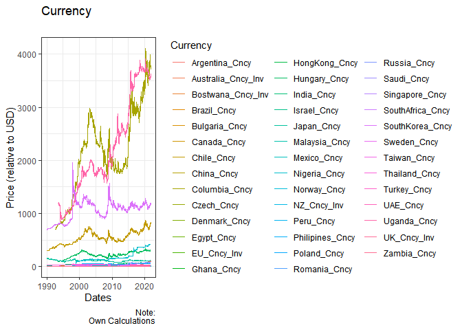
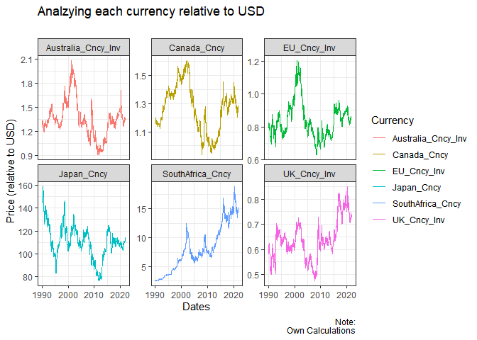
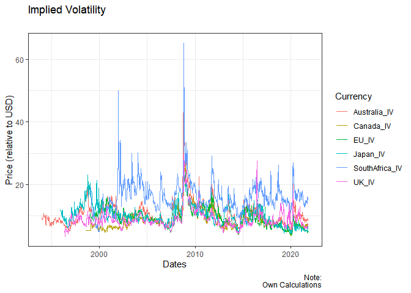
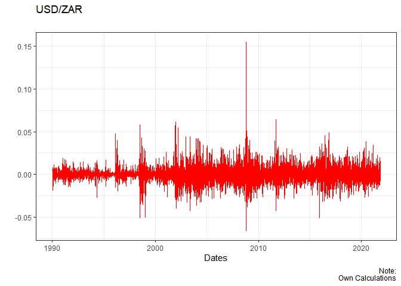
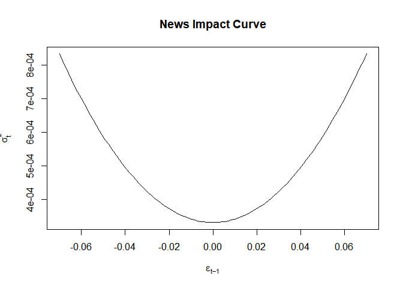
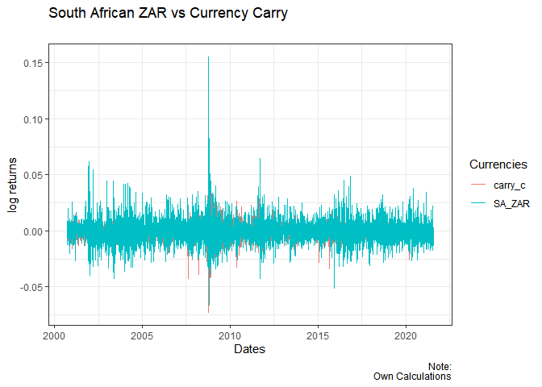

# Question 4

Over the past couple of year, the South African ZAR has been more
volatile when compared to the major currencies. There are many factors
that affect this volatility. A few of the most prominent include
political unrest, central banking policies, economic performance and
outlier events. If any of these underpinnings evolve into a dominant
market driver, exchange rate volatility facing the ZAR spikes. The
result is a destabilisation of the rand and turbulence in the forex
valuations of related pairs.

``` r
rm(list = ls()) # Clean your environment:
getwd()# garbage collection - It can be useful to call gc after a large object has been removed, as this may prompt R to return memory to the operating system.
```

    ## [1] "C:/Users/jesic/OneDrive/Documents/GitHub/20190565/Questions/Question4"

``` r
pacman::p_install_gh('Nicktz/fmxdat')
```

    ## Skipping install of 'fmxdat' from a github remote, the SHA1 (be8e46c2) has not changed since last install.
    ##   Use `force = TRUE` to force installation

    ## 
    ## The following packages were installed:
    ## fmxdat

``` r
library(tidyverse)
```

    ## -- Attaching packages --------------------------------------- tidyverse 1.3.1 --

    ## v ggplot2 3.3.3     v purrr   0.3.4
    ## v tibble  3.1.3     v dplyr   1.0.7
    ## v tidyr   1.1.4     v stringr 1.4.0
    ## v readr   2.0.2     v forcats 0.5.1

    ## -- Conflicts ------------------------------------------ tidyverse_conflicts() --
    ## x dplyr::filter() masks stats::filter()
    ## x dplyr::lag()    masks stats::lag()

``` r
library(rugarch)
```

    ## Loading required package: parallel

    ## 
    ## Attaching package: 'rugarch'

    ## The following object is masked from 'package:purrr':
    ## 
    ##     reduce

    ## The following object is masked from 'package:stats':
    ## 
    ##     sigma

``` r
pacman::p_load(xtable)
pacman::p_load(PerformanceAnalytics)
pacman::p_load("tidyverse", "devtools", "rugarch", "forecast", 
    "tbl2xts", "lubridate", "PerformanceAnalytics", "ggthemes", 
    "robustbase")

cncy <- read_rds("data/currencies.rds")
cncy_Carry <- read_rds("data/cncy_Carry.rds")
cncy_value <- read_rds("data/cncy_value.rds")
cncyIV <- read_rds("data/cncyIV.rds")
bbdxy <- read_rds("data/bbdxy.rds")
```

``` r
cncy %>% group_by(date) %>%
ggplot() + 
    geom_line(aes(x=date, y=Price, color=Name)) +
    theme_bw() +  
    labs(x = "Dates", y = "Price (relative to USD)", title = "Currency", subtitle = "", caption = "Note:\nOwn Calculations") + guides(col=guide_legend("Currency"))
```



Since the graph above is difficult to read, I have decided to only
compare the major curries to get a clearer picture. The graph below
displays the Euro, the Great British Pound, the Australian Dollar, the
Canadian dollar, the Japanese Yen and the South African Rand.

``` r
#cncy %>% group_by(Name) %>% pull(Name) %>% unique 
plota <- cncy %>% filter(Name==c("Australia_Cncy_Inv", "Canada_Cncy", "SouthAfrica_Cncy","UK_Cncy_Inv", "EU_Cncy_Inv", "Japan_Cncy"))%>% group_by(date) %>%
ggplot() + 
    geom_line(aes(x=date, y=Price, color=Name)) +
    facet_wrap(~Name, scales = "free_y") +
    theme_bw() +  
    labs(x = "Dates", y = "Price (relative to USD)", title = "Analzying each currency relative to USD", subtitle = "", caption = "Note:\nOwn Calculations") + guides(col=guide_legend("Currency"))

plota
```



## Implied Volatility

Implied volatility is a measure of the expected risk with regards to the
underlying for an option. The measure reflects the market’s view on the
likelihood of movements in prices for the underlying, having the
tendency to increase when prices decline and thus reflect the riskier
picture

Implied volatility is commonly used by the market to pre-empt future
movements of the underlying. High volatility suggests large price
swings, while muted volatility could mean that price fluctuations may be
very much contained.

Implied Volatility is important because it not only incorporates
historical information about asset prices but also market participants’
expectations, frequently not easily quantifiable, about future events.
Looking at the implied volatility graph below, it indicates that South
African Rand experiences much higher volatility compared to other
currencies. It should be kept in mind that South Africa is an emerging
market whereas the other countries curries that are being analyzed are
all developed countries.

``` r
cncyIV %>% group_by(Name) %>% pull(Name) %>% unique 
```

    ##  [1] "Australia_IV"   "Brazil_IV"      "Canada_IV"      "Chile_IV"      
    ##  [5] "China_IV"       "Columbia_IV"    "Czech_IV"       "Denmark_IV"    
    ##  [9] "EU_IV"          "HongKong_IV"    "Hungary_IV"     "India_IV"      
    ## [13] "Israel_IV"      "Japan_IV"       "Malaysia_IV"    "Mexico_IV"     
    ## [17] "Norway_IV"      "NZ_IV"          "Peru_IV"        "Philipines_IV" 
    ## [21] "Poland_IV"      "Romania_IV"     "Russia_IV"      "Saudi_IV"      
    ## [25] "Singapore_IV"   "SouthAfrica_IV" "SouthKorea_IV"  "Sweden_IV"     
    ## [29] "Taiwan_IV"      "Thailand_IV"    "Turkey_IV"      "UK_IV"

``` r
plotb <- cncyIV %>% filter(Name==c("Australia_IV", "Canada_IV", "SouthAfrica_IV","UK_IV", "EU_IV", "Japan_IV"))%>% group_by(date) %>%
ggplot() + 
    geom_line(aes(x=date, y=Price, color=Name)) +
    theme_bw() +  
    labs(x = "Dates", y = "Price (relative to USD)", title = "Implied Volatility ", subtitle = "", caption = "Note:\nOwn Calculations") + guides(col=guide_legend("Currency"))
```

    ## Warning in Name == c("Australia_IV", "Canada_IV", "SouthAfrica_IV", "UK_IV", :
    ## longer object length is not a multiple of shorter object length

``` r
plotb
```



## Univariate GARCH

The graph below shows the USD/ZAR exchange rate. As you can see, the
periods of volatility clustering increases with time. The most
volatility was experiences during the 2008 Global Financial crisis. This
graph gives a good indication to see where the periods of high and low
volatility are.

``` r
plotc <- cncy %>% filter(Name==c("SouthAfrica_Cncy")) %>% group_by(Name) %>%  mutate(dlogprice = log(Price) - log(lag(Price))) %>%
    filter(date > first(date)) %>%
    ggplot() +
    geom_line(aes(x=date,y=dlogprice), color="red") + theme_bw() +  
    labs(x = "Dates", y = "", title = "USD/ZAR", subtitle = "", caption = "Note:\nOwn Calculations") + guides(col=guide_legend("Currency"))


plotc
```

 In the
table below, there are a few summary statistics of the garch model.

results =‘asis’

``` r
data <-  cncy %>% filter(Name==c( "SouthAfrica_Cncy")) %>% group_by(Name) %>%
    mutate(dlogprice = log(Price) - log(lag(Price))) %>%
    filter(date > first(date)) %>%
    select(date, dlogprice)
```

    ## Adding missing grouping variables: `Name`

``` r
garch11 <- 
  
  ugarchspec(
    
    variance.model = list(model = c("sGARCH","gjrGARCH","eGARCH","fGARCH","apARCH")[1], 
                          
    garchOrder = c(1, 1)), 
    
    mean.model = list(armaOrder = c(1, 0), include.mean = TRUE), 
    
    distribution.model = c("norm", "snorm", "std", "sstd", "ged", "sged", "nig", "ghyp", "jsu")[1])

garchfit1 = ugarchfit(spec = garch11,data = data$dlogprice)
slotNames(garchfit1)
```

    ## [1] "fit"   "model"

``` r
names(garchfit1@fit)
```

    ##  [1] "hessian"         "cvar"            "var"             "sigma"          
    ##  [5] "condH"           "z"               "LLH"             "log.likelihoods"
    ##  [9] "residuals"       "coef"            "robust.cvar"     "A"              
    ## [13] "B"               "scores"          "se.coef"         "tval"           
    ## [17] "matcoef"         "robust.se.coef"  "robust.tval"     "robust.matcoef" 
    ## [21] "fitted.values"   "convergence"     "kappa"           "persistence"    
    ## [25] "timer"           "ipars"           "solver"

``` r
names(garchfit1@model)
```

    ##  [1] "modelinc"   "modeldesc"  "modeldata"  "pars"       "start.pars"
    ##  [6] "fixed.pars" "maxOrder"   "pos.matrix" "fmodel"     "pidx"      
    ## [11] "n.start"

``` r
garchfit1@fit$matcoef 
```

    ##            Estimate   Std. Error    t value     Pr(>|t|)
    ## mu     1.386751e-04 6.003738e-05  2.3098123 2.089855e-02
    ## ar1    4.176071e-03 1.183475e-02  0.3528653 7.241894e-01
    ## omega  3.698017e-07 6.192525e-07  0.5971744 5.503910e-01
    ## alpha1 1.023834e-01 1.420009e-02  7.2100533 5.593304e-13
    ## beta1  8.966165e-01 1.358642e-02 65.9935682 0.000000e+00

``` r
Table <- xtable(garchfit1@fit$matcoef)

print(Table, type = "latex", comment = FALSE)
```

    ## \begin{table}[ht]
    ## \centering
    ## \begin{tabular}{rrrrr}
    ##   \hline
    ##  &  Estimate &  Std. Error &  t value & Pr($>$$|$t$|$) \\ 
    ##   \hline
    ## mu & 0.00 & 0.00 & 2.31 & 0.02 \\ 
    ##   ar1 & 0.00 & 0.01 & 0.35 & 0.72 \\ 
    ##   omega & 0.00 & 0.00 & 0.60 & 0.55 \\ 
    ##   alpha1 & 0.10 & 0.01 & 7.21 & 0.00 \\ 
    ##   beta1 & 0.90 & 0.01 & 65.99 & 0.00 \\ 
    ##    \hline
    ## \end{tabular}
    ## \end{table}

The Persistence of the garch is 0.998, which is expected as the
persistence is the alpha and the beta summed together. The news impact
curve also reflects the volatility asymmetry.

``` r
ni <- newsimpact(z = NULL, garchfit1)
plotd <- plot(ni$zx, ni$zy, ylab = ni$yexpr, xlab = ni$xexpr, type = "l", 
    main = "News Impact Curve")
```



``` r
plotd
```

    ## NULL
```{r}
plot(garchfit1, which = 1)
```

```{r}
plot(garchfit1, which = 3)
```


```{r}
plot(garchfit1, which = 8)
```


```{r}
plot(garchfit1, which = 9)
```
## Carry trade

The carry trade strategy has been popular around investors since 1980,
since on average, the returns are positive. As can be seen in the graph
below, the Deutsche Bank G10 harvest Index and the South African ZAR
follow eachother, with the ZAR being slightly more volatile. This means
that carry trades serve as a good indicater for the USD/ZAR exchange
rate.

``` r
carry <- cncy_Carry %>% mutate(carry_c = log(Price) - log(lag(Price))) %>%
    mutate(scaledret = (carry_c - mean(carry_c, na.rm = T))) %>% 
filter(date > first(date))  %>%
    select(date, carry_c)
   

data <-  cncy %>% filter(Name==c( "SouthAfrica_Cncy")) %>%
    mutate(SA_ZAR = log(Price) - log(lag(Price))) %>%
    mutate(scaledprice = (SA_ZAR - mean(SA_ZAR, na.rm = T))) %>%
    filter(date > first(date)) %>%
     filter(date >= lubridate::ymd(20000919)) %>%
    select(date, SA_ZAR)


plotg <- left_join(carry, data, by= "date") %>% gather(Name, price, -date) %>% ggplot() + geom_line(aes(x=date,y=price, color=Name)) +
     theme_bw() +  
    labs(x = "Dates", y = "log returns", title = "South African ZAR vs Currency Carry", subtitle = "", caption = "Note:\nOwn Calculations") + guides(col=guide_legend("Currencies"))

plotg
```


