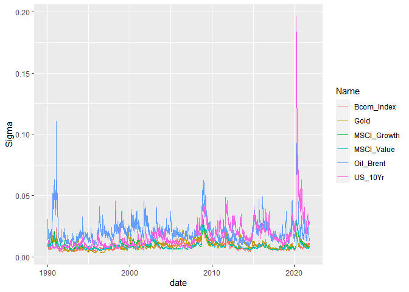

# Question 5

``` r
rm(list = ls()) # Clean your environment:
gc() # garbage collection - It can be useful to call gc after a large object has been removed, as this may prompt R to return memory to the operating system.
```

    ##          used (Mb) gc trigger (Mb) max used (Mb)
    ## Ncells 395335 21.2     810058 43.3   638940 34.2
    ## Vcells 713863  5.5    8388608 64.0  1633464 12.5

``` r
library(tidyverse)
```

    ## -- Attaching packages --------------------------------------- tidyverse 1.3.1 --

    ## v ggplot2 3.3.3     v purrr   0.3.4
    ## v tibble  3.1.3     v dplyr   1.0.7
    ## v tidyr   1.1.4     v stringr 1.4.0
    ## v readr   2.0.2     v forcats 0.5.1

    ## -- Conflicts ------------------------------------------ tidyverse_conflicts() --
    ## x dplyr::filter() masks stats::filter()
    ## x dplyr::lag()    masks stats::lag()

``` r
list.files('code/', full.names = T, recursive = T) %>% .[grepl('.R', .)] %>% as.list() %>% walk(~source(.))
```

The main idea underlying these portmanteau tests is to identify if there
is any dependence structure which is yet unexplained by the fitted
model. The MARCH test indicates that all the MV portmanteau tests reject
the null of no conditional heteroskedasticity, which supports the use of
MVGARCH models.

``` r
msci <- read_rds("data/msci.rds")
bonds <- read_rds("data/bonds_10y.rds")
comms <- read_rds("data/comms.rds")
pacman::p_load("MTS", "robustbase")
pacman::p_load("tidyverse", "devtools", "rugarch", "rmgarch", 
    "forecast", "tbl2xts", "lubridate", "PerformanceAnalytics", 
    "ggthemes")

# msci %>%mutate(MSCI = gsub("MSCI_", "", Name)) %>% select(-Name) %>% pull(MSCI) %>% unique

msci %>% mutate(MSCI = gsub("MSCI_", "", Name)) %>% 
    select(-Name) %>%
    filter(MSCI == c("RE", "USREIT", "ACWI")) %>% 
    select(date, MSCI, Price) %>%
    spread(MSCI, Price)
```

    ## # A tibble: 4,320 x 4
    ##    date        ACWI    RE USREIT
    ##    <date>     <dbl> <dbl>  <dbl>
    ##  1 1994-12-30    NA 100.      NA
    ##  2 1995-01-04    NA  97.7     NA
    ##  3 1995-01-09    NA  93.7     NA
    ##  4 1995-01-12    NA  92.5     NA
    ##  5 1995-01-17    NA  94.0     NA
    ##  6 1995-01-20    NA  90.9     NA
    ##  7 1995-01-25    NA  89.5     NA
    ##  8 1995-01-30    NA  93.6     NA
    ##  9 1995-02-02    NA  94.4     NA
    ## 10 1995-02-07    NA  97.5     NA
    ## # ... with 4,310 more rows

``` r
data <- left_join(msci %>% arrange(date) %>%
                      group_by(Name) %>% 
                      mutate(Price = (Price/lag(Price)) -1) %>%
                     spread(Name, Price), comms %>%
                      group_by(Name) %>% 
                      mutate(Price = Price/lag(Price) -1) %>% 
                      spread(Name, Price), by= "date")

together <- left_join(data, bonds %>%
                      group_by(Name) %>% 
                      mutate(Bond_10Yr = Bond_10Yr/lag(Bond_10Yr) -1) %>%
                          spread(Name, Bond_10Yr), by="date")  %>% select(date, MSCI_Value, MSCI_Growth, US_10Yr, Gold, Oil_Brent, Bcom_Index) %>%
    filter(date > lubridate::ymd(19900101)) %>%
    gather(Name, Price, -date)
  
    
xts_rtn <- together %>% tbl_xts(., cols_to_xts = "Price", spread_by = "Name")
MarchTest(xts_rtn)
```

    ## Q(m) of squared series(LM test):  
    ## Test statistic:  7746.722  p-value:  0 
    ## Rank-based Test:  
    ## Test statistic:  8841.235  p-value:  0 
    ## Q_k(m) of squared series:  
    ## Test statistic:  16745.55  p-value:  0 
    ## Robust Test(5%) :  9194.501  p-value:  0

The dynamic conditional correlation (DCC) models offer a simple and more
parsimonious means of doing MV-vol modeling. The graph below estimates
the volatility for each series.

As seen in the graph, oil was much more volatility than other
commodities, equities and bonds in the early 1990’s. This is due to
Iraq’s invasion of Kuwait and the first Gulf war send prices to a then
all-time high of $41.90 a barrel in October but gains are short-lived as
U.S.-led forces secure the giant oilfields of Saudi Arabia and tanker
lanes in the Gulf.

After the oil price stabilized in the early 1990’s, volatility for
bonds, commodities and equities have been very similar and seem to move
in the same direction. This can be an indication that different asset
classes have increased in their convergences. Holding different asset
classes if not diversification. This is simply not putting your egg in
the same basket. However, investors should instead put different eggs in
negatively correlated basket. The graph below suggest that in the early
1990’s, different asset classes may have been efficient enough for
diversification, but not anymore.

For the 2020 time-period, the US 10 year bond has a much sigma then the
other asset classes. However, it it important to remember that this is
during a nation-wide pandemic, and it is not the norm. Overall, oil
prices seem to be the most volatile.

``` r
DCCPre <- dccPre(xts_rtn, include.mean = T, p = 0)
```

    ## Sample mean of the returns:  0.0002128666 0.0002929664 2.959201e-05 0.0002280285 0.0004308639 5.40033e-05

    ## Warning: Using formula(x) is deprecated when x is a character vector of length > 1.
    ##   Consider formula(paste(x, collapse = " ")) instead.

    ## Component:  1 
    ## Estimates:  1e-06 0.018609 0.973635 
    ## se.coef  :  0 0.00098 0.001392 
    ## t-value  :  10.43903 18.99205 699.4573

    ## Warning: Using formula(x) is deprecated when x is a character vector of length > 1.
    ##   Consider formula(paste(x, collapse = " ")) instead.

    ## Component:  2 
    ## Estimates:  0 0.017774 0.976394 
    ## se.coef  :  0 0.000938 0.001188 
    ## t-value  :  10.59221 18.95358 822.206

    ## Warning: Using formula(x) is deprecated when x is a character vector of length > 1.
    ##   Consider formula(paste(x, collapse = " ")) instead.

    ## Component:  3 
    ## Estimates:  1e-06 0.061477 0.938376 
    ## se.coef  :  0 0.004266 0.003953 
    ## t-value  :  4.901468 14.41016 237.4113

    ## Warning: Using formula(x) is deprecated when x is a character vector of length > 1.
    ##   Consider formula(paste(x, collapse = " ")) instead.

    ## Component:  4 
    ## Estimates:  0 0.044186 0.956347 
    ## se.coef  :  0 0.003096 0.002789 
    ## t-value  :  4.181834 14.27213 342.958

    ## Warning: Using formula(x) is deprecated when x is a character vector of length > 1.
    ##   Consider formula(paste(x, collapse = " ")) instead.

    ## Component:  5 
    ## Estimates:  4e-06 0.07603 0.918303 
    ## se.coef  :  1e-06 0.005067 0.005223 
    ## t-value  :  5.849574 15.00597 175.8205

    ## Warning: Using formula(x) is deprecated when x is a character vector of length > 1.
    ##   Consider formula(paste(x, collapse = " ")) instead.

    ## Component:  6 
    ## Estimates:  0 0.046798 0.949656 
    ## se.coef  :  0 0.003627 0.003794 
    ## t-value  :  4.856683 12.90159 250.278

``` r
names(DCCPre)
```

    ## [1] "marVol"  "sresi"   "est"     "se.coef"

``` r
Vol <- DCCPre$marVol
colnames(Vol) <- colnames(xts_rtn)
Vol <- 
  data.frame( cbind( date = index(xts_rtn), Vol)) %>% 
  mutate(date = as.Date(date)) %>%  tibble::as_tibble()  

TidyVol <- Vol %>% gather(Name, Sigma, -date)

plot9 <- ggplot(TidyVol) + geom_line(aes(x = date, y = Sigma, colour = Name)) 
plot9
```



``` r
StdRes <- DCCPre$sresi

pacman::p_load("tidyverse", "tbl2xts", "broom", "rmsfuns", "fmxdat")
detach("package:tidyverse", unload=TRUE)
detach("package:tbl2xts", unload=TRUE)
```

    ## Warning: 'tbl2xts' namespace cannot be unloaded:
    ##   namespace 'tbl2xts' is imported by 'rmsfuns' so cannot be unloaded

``` r
# DCC <- dccFit(StdRes, type="Engle") # I ran into an error here :"no loop for break/next, jumping to top level" - I tried hard to fix it, but neither me nor google got very far 

pacman::p_load("tidyverse", "tbl2xts", "broom")
```
