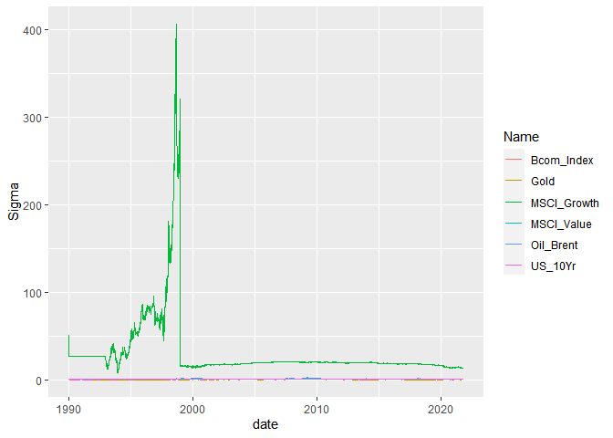

# Purpose

The purpose of this README is to give the solutions to the Financial
Econometrics 2021 exam written on 04 December 2021. There are also
separate Texevier folders for each questions.

``` r
rm(list = ls()) # Clean your environment:
gc() # garbage collection - It can be useful to call gc after a large object has been removed, as this may prompt R to return memory to the operating system.
```

    ##          used (Mb) gc trigger (Mb) max used (Mb)
    ## Ncells 395922 21.2     811735 43.4   638940 34.2
    ## Vcells 719324  5.5    8388608 64.0  1633464 12.5

``` r
library(tidyverse)
```

    ## -- Attaching packages --------------------------------------- tidyverse 1.3.1 --

    ## v ggplot2 3.3.3     v purrr   0.3.4
    ## v tibble  3.1.3     v dplyr   1.0.7
    ## v tidyr   1.1.4     v stringr 1.4.0
    ## v readr   2.0.2     v forcats 0.5.1

    ## -- Conflicts ------------------------------------------ tidyverse_conflicts() --
    ## x dplyr::filter() masks stats::filter()
    ## x dplyr::lag()    masks stats::lag()

``` r
list.files('code/', full.names = T, recursive = T) %>% .[grepl('.R', .)] %>% as.list() %>% walk(~source(.))
```

``` r
# All programs and data used 

pacman::p_install_gh("Nicktz/fmxdat")
```

    ## Skipping install of 'fmxdat' from a github remote, the SHA1 (be8e46c2) has not changed since last install.
    ##   Use `force = TRUE` to force installation

    ## 
    ## The following packages were installed:
    ## fmxdat

``` r
pacman::p_load(tbl2xts, PerformanceAnalytics)
library(tidyverse)
library(dplyr)
library(rportfolios)
```

    ## Loading required package: truncdist

    ## Loading required package: stats4

    ## Loading required package: evd

``` r
library(PerformanceAnalytics)
library(rmsfuns)
library(devtools)
```

    ## Loading required package: usethis

``` r
library(rugarch)
```

    ## Loading required package: parallel

    ## 
    ## Attaching package: 'rugarch'

    ## The following object is masked from 'package:purrr':
    ## 
    ##     reduce

    ## The following object is masked from 'package:stats':
    ## 
    ##     sigma

``` r
pacman::p_load(xtable)
if (!require(FactoMineR)) install.packages("FactoMineR")
```

    ## Loading required package: FactoMineR

``` r
if (!require(factoextra)) install.packages("factoextra")
```

    ## Loading required package: factoextra

    ## Welcome! Want to learn more? See two factoextra-related books at https://goo.gl/ve3WBa

``` r
library(factoextra)
library(FactoMineR)
pacman::p_load("tidyr", "tbl2xts","devtools","lubridate", "readr", "PerformanceAnalytics", "ggplot2", "dplyr")
SA_bonds <- read_rds("data/SA_Bonds.rds")
BE_Infl <- read_rds("data/BE_Infl.rds")
bonds_2y <- read_rds("data/bonds_2y.rds")
bonds_10y <- read_rds("data/bonds_10y.rds")
usdzar <- read_rds("data/usdzar.rds")
ZA_Infl <- read_rds("data/ZA_Infl.rds")
IV <- read_rds("data/IV.rds")
T40 <- read_rds("data/T40.rds")
RebDays <- read_rds("data/Rebalance_days.rds")
msci <- read_rds("data/msci.rds")
bonds <- read_rds("data/bonds_10y.rds")
comms <- read_rds("data/comms.rds")
cncy <- read_rds("data/currencies.rds")
cncy_Carry <- read_rds("data/cncy_Carry.rds")
cncy_value <- read_rds("data/cncy_value.rds")
cncyIV <- read_rds("data/cncyIV.rds")
bbdxy <- read_rds("data/bbdxy.rds")
msci <- read_rds("data/msci.rds")
bonds <- read_rds("data/bonds_10y.rds")
comms <- read_rds("data/comms.rds")
pacman::p_load("MTS", "robustbase")
pacman::p_load("tidyverse", "devtools", "rugarch", "rmgarch", 
    "forecast", "tbl2xts", "lubridate", "PerformanceAnalytics", 
    "ggthemes")
```

# Question 1

Question 1 requires an analysis of South Africa’s Yield Spreads and
local mid to longer dated yields bonds. There have been claims that the
bond yields are the highest they have been in decades. The plot below
confirms this. As seen in the graph, the lowest spread between the local
bond market was during the 2007/2008 financial crises, afterwhich it
dramatically increases in 2010. The dramatic increase was short lived,
with the yield spread increasing slowly between 2011 and 2019. In 2020,
the yield spread between the 10 Year and 2 year, as well as the yield
spread between the 10 year and 3 month local bonds increased
dramatically. The yield spread between the 2 year and 3 month local
bonds also experienced an increase, however, this increase reached
levels similar to those experienced in 2000/2001.

In increase in the yield spread can be explained by the uncertainty in
the markets during the still on-going COVID-19 pandemic. Investors
rushed to raise liquidity amid the uncertainty and panic, particularly
those regarded as having a hint of risk. South African government bonds
did not escape the effect of the pandemic, with significant sales of the
asset class by foreigners, causing yields to spike and prices to move
lower.

``` r
## SA_Bonds 
plot2 <- SA_bonds %>% mutate("10 Year and 3 Month"=SA_bonds$ZA_10Yr - SA_bonds$SA_3M, "2 Year and 3 Month" = SA_bonds$ZA_2Yr - SA_bonds$SA_3M, "10 Year and 2 Year"= SA_bonds$ZA_10Yr-SA_bonds$ZA_2Yr) %>% select(date, "10 Year and 3 Month", "2 Year and 3 Month", "10 Year and 2 Year") %>% gather(yield_spread, points, -date) %>% ggplot() + 
    geom_line(aes(x=date, y=points, color=yield_spread)) +
    theme_bw() +  
    labs(x = "Dates", y = "Spread", title = "Yeild Spread in Local Bond Market", subtitle = "Comparing Yeild Spread Between 3m, 2Y and 10Y bonds", caption = "Note:\nOwn Calculations") + guides(col=guide_legend("Yield Spread Between:"))

plot2
```


This effect felt are not isolated to the South African bond market, with
all emerging market local currency debt selling off in unison, as will
be shown in the graphs below. This graph follows a similar pattern ad
the local bonds yeild spread.

``` r
plot3 <- left_join(SA_bonds %>% select(date, ZA_10Yr), bonds_10y %>% group_by(bonds_10y$Name) %>% filter(Name=="US_10Yr") %>% ungroup() %>% arrange(date) %>% filter(date >= lubridate::ymd(19991206)) , by= "date") %>% select(-c("bonds_10y$Name", "Name")) %>% mutate( spread = ZA_10Yr - Bond_10Yr) %>% ggplot() + geom_line(aes(x=date, y=spread), color="purple") +
 theme_bw() +  
    labs(x = "Dates", y = "Spread", title = "Yield Spread Between US and SA 10 Year Bonds", subtitle = "", caption = "Note:\nOwn Calculations")

plot3
```


## USD/ZAR level

The spreads of the 10-year bond yields can be used to gauge currencies.
The general rule is that when the yield spread widens in favor of a
certain currency, that currency will appreciate against other
currencies.

Yield spreads are often seen as driven by monetary policy. Differences
in the exchange rate will drastically affect the expected yield. The
graph below shows that this is true for longer term bonds, however,
there is more volatility is shorter term bonds implying that the
exchange rate is not that good of a predictor and that monetary policy
changes will drastically affect the yield.

``` r
plot1 <- usdzar %>% ggplot()+ geom_line(aes(x=date, y=Price), color="blue") +
   
theme_bw() +  labs(x = "", y = "Prices (ZAR)", title = "USD/ZAR Exchange Rate", subtitle = "Data given in SA currency ", caption = "Note:\nOwn Calculations")
plot1
```


## Different Yeild Spreads

Comparing the 10 year and 2 year bond is important, so that investor can
determine whether a bond is fairly priced, cheap or expensive. It is a
sign of the risk premium for investing in one investment over another.

``` r
left_join(SA_bonds %>% select(date, ZA_10Yr), bonds_10y %>% tbl_xts(.,cols_to_xts= "Bond_10Yr", spread_by ="Name") %>% xts_tbl() %>% filter(date >= lubridate::ymd(19991206)) %>% select(date, AUS_10Yr, Canada_10Yr, EURO_10Yr,UK_10Yr) %>% arrange(date), by= "date") %>% mutate( ZA_AUS = ZA_10Yr - AUS_10Yr, ZA_Canada = ZA_10Yr -Canada_10Yr, ZA_EURO = ZA_10Yr - EURO_10Yr, ZA_UK = ZA_10Yr - UK_10Yr) %>% select(date, ZA_AUS,ZA_Canada, ZA_EURO, ZA_UK) %>% gather(country, spread, -date) %>%
 ggplot() + geom_line(aes(x=date, y=spread, color=country)) +
 theme_bw() +  
    labs(x = "Dates", y = "Spread", title = "Yeild Spread Between Different Countries and SA 10 Year Bonds", subtitle = "Countries include United Kingdom, Europe, Cananda and Australie", caption = "Note:\nOwn Calculations")
```


``` r
left_join(SA_bonds %>% select(date, ZA_2Yr), bonds_2y %>% tbl_xts(.,cols_to_xts= "Bond_2Yr", spread_by ="Name") %>% xts_tbl() %>% filter(date >= lubridate::ymd(19991206)) %>% select(date, AUS_2yr, Canada_2yr, EURO_2yr,UK_2yr, US_2yr) %>% arrange(date), by= "date") %>% mutate( ZA_AUS = ZA_2Yr - AUS_2yr, ZA_Canada = ZA_2Yr -Canada_2yr, ZA_EURO = ZA_2Yr - EURO_2yr, ZA_UK = ZA_2Yr - UK_2yr, ZA_US = ZA_2Yr - US_2yr) %>% select(date, ZA_AUS,ZA_Canada, ZA_EURO, ZA_UK, ZA_US) %>% gather(country, spread, -date) %>%
 ggplot() + geom_line(aes(x=date, y=spread, color=country)) +
 theme_bw() +  
    labs(x = "Dates", y = "Spread", title = "Yeild Spread Between Different Countries and SA 2 Year Bonds", subtitle = "Countries include United Kingdom, Europe, Cananda, Australia, United States", caption = "Note:\nOwn Calculations")
```

    ## Warning: Removed 5 row(s) containing missing values (geom_path).

 \#\#
Inflation In principle, the yield spread contains information on
expectations of future inflation that can be extracted as an estimate of
them. Studies of US and other markets have demonstrated that the yield
curve does contain information on expected and actual future levels of
gross domestic product (GDP) growth, and can be a lead indicator of
business cycle downturns.

Although many studies indicate the inflation-predicting power of the
yield curve in developed countries’ markets, little is known of the
relationship in emerging economies. The graph below mostly supports the
notion that the yield spread contains valuable information about
expected inflation, where price refers to the inflation rate. However,
it is important to notice that inflation has much higher volatility then
yield spread. The graph below shows that the higher the current rate of
inflation, the higher the yields will rise across the yield curve, as
investors will demand this higher yield to compensate for inflation risk

``` r
data <- left_join(SA_bonds %>% select(date, ZA_10Yr), bonds_10y %>% group_by(bonds_10y$Name) %>% filter(Name=="US_10Yr") %>% ungroup() %>% arrange(date) %>% filter(date >= lubridate::ymd(19991206)) , by= "date") %>% select(-c("bonds_10y$Name", "Name")) %>% mutate( spread = ZA_10Yr - Bond_10Yr) %>% select(date, spread)

left_join(ZA_Infl %>%  filter(date >= lubridate::ymd(19991206)) %>% select(-Name) , data, by = "date") %>% na.omit() %>% gather(Data, Values, -date) %>% ggplot() + geom_line(aes(x=date, y=Values, color=Data)) +
 theme_bw() +  
    labs(x = "Dates", y = "", title = "Comparing Inflation and Yield Spread", subtitle = "Yeild Spread is between US and ZAR 10 year bond", caption = "Note:\nOwn Calculations")
```


# Question 2

# Question 3

With the code, I can confirm that there are 92 PCA. This number is a
large, however, there are 92 unique tickets in the Top40.This is because
every year, some stocks get dropped form the Top40, while others get
added. Each of the 92 components explains a percentage of the total
variation in the T40 returns. That is, PC1 explains 8 % of the total
variance, which is the most out of the 92 PCA’s. PC50 to PC92 all
explain less than 1 percent of the total variance. The table below plots
the individuals components importance.

``` r
#Calculating returns
T40 <- read_rds("data/T40.rds")

T40[sapply(T40, is.infinite)] <- NA
T40[T40 == 0] <- NA
    
T40 <- read_rds("data/T40.rds") %>% na.locf(.,na.rm=T, 5) %>%
    select(date, Tickers, Return, J200) %>%
    mutate(Return = Return*J200) %>%
    select(date, Tickers, Return) %>% 
    group_by(Tickers) %>%
    mutate(Tickers = gsub(" SJ Equity", "", Tickers))

return_mat <- T40 %>% spread(Tickers,Return) 
#colSums(is.na(T40))

impute_missing_returns <- function(return_mat, impute_returns_method = "NONE", Seed = 1234){
  # Make sure we have a date column called date:
  if( !"date" %in% colnames(return_mat) ) stop("No 'date' column provided in return_mat. Try again please.")

  # Note my use of 'any' below...
  # Also note that I 'return' return_mat - which stops the function and returns return_mat. 
  if( impute_returns_method %in% c("NONE", "None", "none") ) {
    if( any(is.na(return_mat)) ) warning("There are missing values in the return matrix.. Consider maybe using impute_returns_method = 'Drawn_Distribution_Own' / 'Drawn_Distribution_Collective'")
    return(return_mat)
  }

  
  if( impute_returns_method  == "Average") {

    return_mat <-
      return_mat %>% gather(Stocks, Returns, -date) %>%
      group_by(date) %>%
      mutate(Avg = mean(Returns, na.rm=T)) %>%
      mutate(Avg = coalesce(Avg, 0)) %>% # date with no returns - set avg to zero
      ungroup() %>%
      mutate(Returns = coalesce(Returns, Avg)) %>% select(-Avg) %>% spread(Stocks, Returns)

    # That is just so much easier when tidy right? See how I gathered and spread again to give back a wide df?
    
  } else

    if( impute_returns_method  == "Drawn_Distribution_Own") {

      set.seed(Seed)
      N <- nrow(return_mat)
      return_mat <-

        left_join(return_mat %>% gather(Stocks, Returns, -date),
                  return_mat %>% gather(Stocks, Returns, -date) %>% group_by(Stocks) %>%
                    do(Dens = density(.$Returns, na.rm=T)) %>%
                    ungroup() %>% group_by(Stocks) %>% # done to avoid warning.
                    do(Random_Draws = sample(.$Dens[[1]]$x, N, replace = TRUE, prob=.$Dens[[1]]$y)),
                  by = "Stocks"
        ) %>%  group_by(Stocks) %>% mutate(Row = row_number()) %>% mutate(Returns = coalesce(Returns, Random_Draws[[1]][Row])) %>%
        select(-Random_Draws, -Row) %>% ungroup() %>% spread(Stocks, Returns)

    } else

      if( impute_returns_method  == "Drawn_Distribution_Collective") {

        set.seed(Seed)
        NAll <- nrow(return_mat %>% gather(Stocks, Returns, -date))

        return_mat <-
          bind_cols(
          return_mat %>% gather(Stocks, Returns, -date),
          return_mat %>% gather(Stocks, Returns, -date) %>%
            do(Dens = density(.$Returns, na.rm=T)) %>%
            do(Random_Draws = sample(.$Dens[[1]]$x, NAll, replace = TRUE, prob=.$Dens[[1]]$y)) %>% unnest(Random_Draws)
          ) %>%
          mutate(Returns = coalesce(Returns, Random_Draws)) %>% select(-Random_Draws) %>% spread(Stocks, Returns)

      } else

        if( impute_returns_method  == "Zero") {
        warning("This is probably not the best idea but who am I to judge....")
          return_mat[is.na(return_mat)] <- 0

        } else
          stop("Please provide a valid impute_returns_method method. Options include:\n'Average', 'Drawn_Distribution_Own', 'Drawn_Distribution_Collective' and 'Zero'.")
}


options(scipen = 999) # Stop the scientific notation of

return_mat <- impute_missing_returns(return_mat, impute_returns_method = "Drawn_Distribution_Collective", Seed = as.numeric(format( Sys.time(), "%Y%d%H%M")))

return_mat_Nodate <- data.matrix(return_mat[, -1])

# Simple Sample covariance and mean:
Sigma <- RiskPortfolios::covEstimation(return_mat_Nodate)
Mu <- RiskPortfolios::meanEstimation(return_mat_Nodate)

#PCA calculations
pca <- prcomp(return_mat_Nodate,center=TRUE, scale.=TRUE)
d <- str(pca)
```

    ## List of 5
    ##  $ sdev    : num [1:92] 2.82 1.63 1.29 1.25 1.14 ...
    ##  $ rotation: num [1:92, 1:92] 0.2592 0.0247 0.0175 0.2143 0.1304 ...
    ##   ..- attr(*, "dimnames")=List of 2
    ##   .. ..$ : chr [1:92] "ABG" "ACL" "AEG" "AGL" ...
    ##   .. ..$ : chr [1:92] "PC1" "PC2" "PC3" "PC4" ...
    ##  $ center  : Named num [1:92] 0.00000431 0.0000075 0.00002149 0.00001858 -0.00000261 ...
    ##   ..- attr(*, "names")= chr [1:92] "ABG" "ACL" "AEG" "AGL" ...
    ##  $ scale   : Named num [1:92] 0.000281 0.000782 0.000839 0.002478 0.000541 ...
    ##   ..- attr(*, "names")= chr [1:92] "ABG" "ACL" "AEG" "AGL" ...
    ##  $ x       : num [1:3458, 1:92] 2.87 -2.64 -1.47 -2.3 1.69 ...
    ##   ..- attr(*, "dimnames")=List of 2
    ##   .. ..$ : NULL
    ##   .. ..$ : chr [1:92] "PC1" "PC2" "PC3" "PC4" ...
    ##  - attr(*, "class")= chr "prcomp"

``` r
c <- pca$sdev #extracting standard deviation.
eigenvalues <- pca$sdev^2
b<- pca$rotation
a <- summary(pca)
a
```

    ## Importance of components:
    ##                            PC1     PC2     PC3     PC4     PC5     PC6     PC7
    ## Standard deviation     2.81999 1.62800 1.29359 1.24760 1.14409 1.13310 1.13005
    ## Proportion of Variance 0.08644 0.02881 0.01819 0.01692 0.01423 0.01396 0.01388
    ## Cumulative Proportion  0.08644 0.11525 0.13344 0.15035 0.16458 0.17854 0.19242
    ##                            PC8     PC9    PC10    PC11    PC12    PC13   PC14
    ## Standard deviation     1.11580 1.11109 1.10469 1.10100 1.09820 1.08680 1.0852
    ## Proportion of Variance 0.01353 0.01342 0.01326 0.01318 0.01311 0.01284 0.0128
    ## Cumulative Proportion  0.20595 0.21937 0.23263 0.24581 0.25892 0.27176 0.2846
    ##                           PC15    PC16    PC17    PC18    PC19    PC20    PC21
    ## Standard deviation     1.07900 1.07474 1.07202 1.06849 1.06666 1.06061 1.05575
    ## Proportion of Variance 0.01265 0.01256 0.01249 0.01241 0.01237 0.01223 0.01212
    ## Cumulative Proportion  0.29721 0.30977 0.32226 0.33467 0.34704 0.35926 0.37138
    ##                           PC22   PC23    PC24    PC25    PC26    PC27    PC28
    ## Standard deviation     1.05191 1.0509 1.04551 1.04366 1.03880 1.03608 1.03372
    ## Proportion of Variance 0.01203 0.0120 0.01188 0.01184 0.01173 0.01167 0.01162
    ## Cumulative Proportion  0.38341 0.3954 0.40729 0.41913 0.43086 0.44253 0.45414
    ##                           PC29    PC30    PC31   PC32    PC33    PC34    PC35
    ## Standard deviation     1.03132 1.02773 1.02251 1.0194 1.01478 1.01384 1.01112
    ## Proportion of Variance 0.01156 0.01148 0.01136 0.0113 0.01119 0.01117 0.01111
    ## Cumulative Proportion  0.46570 0.47719 0.48855 0.4998 0.51104 0.52221 0.53332
    ##                           PC36   PC37    PC38    PC39    PC40    PC41    PC42
    ## Standard deviation     1.00752 1.0013 0.99847 0.99341 0.99144 0.98902 0.98629
    ## Proportion of Variance 0.01103 0.0109 0.01084 0.01073 0.01068 0.01063 0.01057
    ## Cumulative Proportion  0.54436 0.5553 0.56609 0.57682 0.58750 0.59813 0.60871
    ##                           PC43    PC44    PC45    PC46    PC47   PC48    PC49
    ## Standard deviation     0.98332 0.97745 0.97459 0.97372 0.96847 0.9638 0.96215
    ## Proportion of Variance 0.01051 0.01038 0.01032 0.01031 0.01019 0.0101 0.01006
    ## Cumulative Proportion  0.61922 0.62960 0.63993 0.65023 0.66043 0.6705 0.68059
    ##                           PC50    PC51    PC52    PC53   PC54    PC55    PC56
    ## Standard deviation     0.96047 0.95728 0.95602 0.94823 0.9447 0.94077 0.93544
    ## Proportion of Variance 0.01003 0.00996 0.00993 0.00977 0.0097 0.00962 0.00951
    ## Cumulative Proportion  0.69061 0.70057 0.71051 0.72028 0.7300 0.73960 0.74911
    ##                           PC57   PC58    PC59    PC60    PC61    PC62    PC63
    ## Standard deviation     0.93393 0.9302 0.92655 0.92115 0.91942 0.91434 0.91285
    ## Proportion of Variance 0.00948 0.0094 0.00933 0.00922 0.00919 0.00909 0.00906
    ## Cumulative Proportion  0.75859 0.7680 0.77733 0.78655 0.79574 0.80483 0.81389
    ##                           PC64    PC65    PC66    PC67    PC68    PC69    PC70
    ## Standard deviation     0.90805 0.90524 0.90227 0.90095 0.89498 0.88746 0.88345
    ## Proportion of Variance 0.00896 0.00891 0.00885 0.00882 0.00871 0.00856 0.00848
    ## Cumulative Proportion  0.82285 0.83176 0.84060 0.84943 0.85813 0.86670 0.87518
    ##                           PC71    PC72    PC73    PC74    PC75   PC76    PC77
    ## Standard deviation     0.88225 0.87554 0.86225 0.86048 0.84660 0.8363 0.83151
    ## Proportion of Variance 0.00846 0.00833 0.00808 0.00805 0.00779 0.0076 0.00752
    ## Cumulative Proportion  0.88364 0.89197 0.90005 0.90810 0.91589 0.9235 0.93101
    ##                           PC78    PC79    PC80    PC81    PC82    PC83    PC84
    ## Standard deviation     0.82172 0.81170 0.80340 0.78140 0.76212 0.71197 0.68862
    ## Proportion of Variance 0.00734 0.00716 0.00702 0.00664 0.00631 0.00551 0.00515
    ## Cumulative Proportion  0.93835 0.94551 0.95253 0.95916 0.96548 0.97099 0.97614
    ##                           PC85    PC86    PC87    PC88    PC89    PC90    PC91
    ## Standard deviation     0.67198 0.62698 0.60226 0.51428 0.49942 0.47910 0.40543
    ## Proportion of Variance 0.00491 0.00427 0.00394 0.00287 0.00271 0.00249 0.00179
    ## Cumulative Proportion  0.98105 0.98532 0.98926 0.99214 0.99485 0.99734 0.99913
    ##                           PC92
    ## Standard deviation     0.28268
    ## Proportion of Variance 0.00087
    ## Cumulative Proportion  1.00000

``` r
fviz_screeplot(pca, ncp = 10)
```


As can be seen in the plot below, there is not one variable that makes a
significant contribution to the variance. Therefore, you will need to
consider all variables of the Top40 to understand how the variance is
affected. This graph is not very informative as we don’t know which
graph belongs to which Ticker. However, adding in rownames makes the
plot very messy.

``` r
install_github("vqv/ggbiplot")
```

    ## Skipping install of 'ggbiplot' from a github remote, the SHA1 (7325e880) has not changed since last install.
    ##   Use `force = TRUE` to force installation

``` r
library(ggbiplot)
```

    ## Loading required package: plyr

    ## ------------------------------------------------------------------------------

    ## You have loaded plyr after dplyr - this is likely to cause problems.
    ## If you need functions from both plyr and dplyr, please load plyr first, then dplyr:
    ## library(plyr); library(dplyr)

    ## ------------------------------------------------------------------------------

    ## 
    ## Attaching package: 'plyr'

    ## The following objects are masked from 'package:dplyr':
    ## 
    ##     arrange, count, desc, failwith, id, mutate, rename, summarise,
    ##     summarize

    ## The following object is masked from 'package:purrr':
    ## 
    ##     compact

    ## Loading required package: scales

    ## 
    ## Attaching package: 'scales'

    ## The following object is masked from 'package:purrr':
    ## 
    ##     discard

    ## The following object is masked from 'package:readr':
    ## 
    ##     col_factor

    ## Loading required package: grid

``` r
ggbiplot(pca)
```


With the 92 PCA, the information that we gain is not very useful.

## Cumulative Return

The graph below gives the cumulative returns for all the unique stocks
in the Top40, with different starting dates. Sinces we are analyzing 92
different stocks, the graph is still not clear as to which stocks
contribute the most to the top40 portfolio.

``` r
gg <-  read_rds("data/T40.rds")%>%
    select(date, Tickers, Return, J200) %>%
    mutate(Return = Return*J200) %>%
    select(date, Tickers, Return) %>% 
    arrange(date) %>%
    group_by(Tickers) %>%
    mutate(Tickers = gsub(" SJ Equity", "", Tickers)) %>% 
        mutate(Rets = coalesce(Return, 0)) %>%  
        mutate(CP = cumprod(1 + Rets)) %>% 
        ungroup() %>% ggplot() + 
geom_line(aes(date, CP, color = Tickers)) + 
labs(title = "Cumulative Returns of various Indices", 
    subtitle = "", caption = "Note:\nDistortions emerge as starting dates differ.")
# Level plot
gg
```


# Question 4

Over the past couple of year, the South African ZAR has been more
volatile when compared to the major currencies. There are many factors
that affect this volatility. A few of the most prominent include
political unrest, central banking policies, economic performance and
outlier events. If any of these underpinnings evolve into a dominant
market driver, exchange rate volatility facing the ZAR spikes. The
result is a destabilisation of the rand and turbulence in the forex
valuations of related pairs.

``` r
cncy %>% group_by(date) %>%
ggplot() + 
    geom_line(aes(x=date, y=Price, color=Name)) +
    theme_bw() +  
    labs(x = "Dates", y = "Price (relative to USD)", title = "Currency", subtitle = "", caption = "Note:\nOwn Calculations") + guides(col=guide_legend("Currency"))
```


Since the graph above is difficult to read, I have decided to only
compare the major curries to get a clearer picture. The graph below
displays the Euro, the Great British Pound, the Australian Dollar, the
Canadian dollar, the Japanese Yen and the South African Rand.

``` r
#cncy %>% group_by(Name) %>% pull(Name) %>% unique 
plota <- cncy %>% filter(Name==c("Australia_Cncy_Inv", "Canada_Cncy", "SouthAfrica_Cncy","UK_Cncy_Inv", "EU_Cncy_Inv", "Japan_Cncy"))%>% group_by(date) %>%
ggplot() + 
    geom_line(aes(x=date, y=Price, color=Name)) +
    facet_wrap(~Name, scales = "free_y") +
    theme_bw() +  
    labs(x = "Dates", y = "Price (relative to USD)", title = "Analzying each currency relative to USD", subtitle = "", caption = "Note:\nOwn Calculations") + guides(col=guide_legend("Currency"))

plota
```


## Implied Volatility

Implied volatility is a measure of the expected risk with regards to the
underlying for an option. The measure reflects the market’s view on the
likelihood of movements in prices for the underlying, having the
tendency to increase when prices decline and thus reflect the riskier
picture

Implied volatility is commonly used by the market to pre-empt future
movements of the underlying. High volatility suggests large price
swings, while muted volatility could mean that price fluctuations may be
very much contained.

Implied Volatility is important because it not only incorporates
historical information about asset prices but also market participants’
expectations, frequently not easily quantifiable, about future events.
Looking at the implied volatility graph below, it indicates that South
African Rand experiences much higher volatility compared to other
currencies. It should be kept in mind that South Africa is an emerging
market whereas the other countries curries that are being analyzed are
all developed countries.

``` r
cncyIV %>% group_by(Name) %>% pull(Name) %>% unique 
```

    ##  [1] "Australia_IV"   "Brazil_IV"      "Canada_IV"      "Chile_IV"      
    ##  [5] "China_IV"       "Columbia_IV"    "Czech_IV"       "Denmark_IV"    
    ##  [9] "EU_IV"          "HongKong_IV"    "Hungary_IV"     "India_IV"      
    ## [13] "Israel_IV"      "Japan_IV"       "Malaysia_IV"    "Mexico_IV"     
    ## [17] "Norway_IV"      "NZ_IV"          "Peru_IV"        "Philipines_IV" 
    ## [21] "Poland_IV"      "Romania_IV"     "Russia_IV"      "Saudi_IV"      
    ## [25] "Singapore_IV"   "SouthAfrica_IV" "SouthKorea_IV"  "Sweden_IV"     
    ## [29] "Taiwan_IV"      "Thailand_IV"    "Turkey_IV"      "UK_IV"

``` r
plotb <- cncyIV %>% filter(Name==c("Australia_IV", "Canada_IV", "SouthAfrica_IV","UK_IV", "EU_IV", "Japan_IV"))%>% group_by(date) %>%
ggplot() + 
    geom_line(aes(x=date, y=Price, color=Name)) +
    theme_bw() +  
    labs(x = "Dates", y = "Price (relative to USD)", title = "Implied Volatility ", subtitle = "", caption = "Note:\nOwn Calculations") + guides(col=guide_legend("Currency"))
```

    ## Warning in Name == c("Australia_IV", "Canada_IV", "SouthAfrica_IV", "UK_IV", :
    ## longer object length is not a multiple of shorter object length

``` r
plotb
```


## Univariate GARCH

The graph below shows the USD/ZAR exchange rate. As you can see, the
periods of volatility clustering increases with time. The most
volatility was experiences during the 2008 Global Financial crisis. This
graph gives a good indication to see where the periods of high and low
volatility are.

``` r
plotc <- cncy %>% filter(Name==c("SouthAfrica_Cncy")) %>% group_by(Name) %>%  mutate(dlogprice = log(Price) - log(lag(Price))) %>%
    filter(date > lubridate::ymd(19900101)) %>%
    ggplot() +
    geom_line(aes(x=date,y=dlogprice), color="red") + theme_bw() +  
    labs(x = "Dates", y = "", title = "USD/ZAR", subtitle = "", caption = "Note:\nOwn Calculations") + guides(col=guide_legend("Currency"))


plotc
```

 In the
table below, there are a few summary statistics of the garch model.

results =‘asis’

``` r
data <-  cncy %>% filter(Name==c( "SouthAfrica_Cncy")) %>% group_by(Name) %>%
    mutate(dlogprice = log(Price) - log(lag(Price))) %>%
    filter(date > lubridate::ymd(19900101)) %>%
    select(date, dlogprice)
```

    ## Adding missing grouping variables: `Name`

``` r
garch11 <- 
  
  ugarchspec(
    
    variance.model = list(model = c("sGARCH","gjrGARCH","eGARCH","fGARCH","apARCH")[1], 
                          
    garchOrder = c(1, 1)), 
    
    mean.model = list(armaOrder = c(1, 0), include.mean = TRUE), 
    
    distribution.model = c("norm", "snorm", "std", "sstd", "ged", "sged", "nig", "ghyp", "jsu")[1])

garchfit1 = ugarchfit(spec = garch11,data = data$dlogprice)
slotNames(garchfit1)
```

    ## [1] "fit"   "model"

``` r
names(garchfit1@fit)
```

    ##  [1] "hessian"         "cvar"            "var"             "sigma"          
    ##  [5] "condH"           "z"               "LLH"             "log.likelihoods"
    ##  [9] "residuals"       "coef"            "robust.cvar"     "A"              
    ## [13] "B"               "scores"          "se.coef"         "tval"           
    ## [17] "matcoef"         "robust.se.coef"  "robust.tval"     "robust.matcoef" 
    ## [21] "fitted.values"   "convergence"     "kappa"           "persistence"    
    ## [25] "timer"           "ipars"           "solver"

``` r
names(garchfit1@model)
```

    ##  [1] "modelinc"   "modeldesc"  "modeldata"  "pars"       "start.pars"
    ##  [6] "fixed.pars" "maxOrder"   "pos.matrix" "fmodel"     "pidx"      
    ## [11] "n.start"

``` r
garchfit1@fit$matcoef 
```

    ##               Estimate      Std. Error    t value              Pr(>|t|)
    ## mu     0.0001386750867 0.0000600373844  2.3098123 0.0208985500784439893
    ## ar1    0.0041760707352 0.0118347453214  0.3528653 0.7241894402706872125
    ## omega  0.0000003698017 0.0000006192525  0.5971744 0.5503909622348868158
    ## alpha1 0.1023834014790 0.0142000894601  7.2100533 0.0000000000005593304
    ## beta1  0.8966165432813 0.0135864231502 65.9935682 0.0000000000000000000

``` r
Table <- xtable(garchfit1@fit$matcoef)

print(Table, type = "latex", comment = FALSE)
```

    ## \begin{table}[ht]
    ## \centering
    ## \begin{tabular}{rrrrr}
    ##   \hline
    ##  &  Estimate &  Std. Error &  t value & Pr($>$$|$t$|$) \\ 
    ##   \hline
    ## mu & 0.00 & 0.00 & 2.31 & 0.02 \\ 
    ##   ar1 & 0.00 & 0.01 & 0.35 & 0.72 \\ 
    ##   omega & 0.00 & 0.00 & 0.60 & 0.55 \\ 
    ##   alpha1 & 0.10 & 0.01 & 7.21 & 0.00 \\ 
    ##   beta1 & 0.90 & 0.01 & 65.99 & 0.00 \\ 
    ##    \hline
    ## \end{tabular}
    ## \end{table}

The Persistence of the garch is 0.998, which is expected as the
persistence is the alpha and the beta summed together. The news impact
curve also reflects the volatility asymmetry.

``` r
ni <- newsimpact(z = NULL, garchfit1)
plotd <- plot(ni$zx, ni$zy, ylab = ni$yexpr, xlab = ni$xexpr, type = "l", 
    main = "News Impact Curve")
```


``` r
plotd
```

    ## NULL


```{r}
plot(garchfit1, which = 1)
```

```{r}
plot(garchfit1, which = 3)
```


```{r}
plot(garchfit1, which = 8)
```


```{r}
plot(garchfit1, which = 9)
```
## Carry trades

The carry trade strategy has been popular around investors since 1980,
since on average, the returns are positive. As can be seen in the graph
below, the Deutsche Bank G10 harvest Index and the South African ZAR
follow eachother, with the ZAR being slightly more volatile. This means
that carry trades serve as a good indicater for the USD/ZAR exchange
rate.

``` r
carry <- cncy_Carry %>% mutate(carry_c = log(Price) - log(lag(Price))) %>%
    mutate(scaledret = (carry_c - mean(carry_c, na.rm = T))) %>% 
filter(date > lubridate::ymd(19900101))  %>%
    select(date, carry_c)
   

data <-  cncy %>% filter(Name==c( "SouthAfrica_Cncy")) %>%
    mutate(SA_ZAR = log(Price) - log(lag(Price))) %>%
    mutate(scaledprice = (SA_ZAR - mean(SA_ZAR, na.rm = T))) %>%
    filter(date > lubridate::ymd(19900101)) %>%
     filter(date >= lubridate::ymd(20000919)) %>%
    select(date, SA_ZAR)


plotg <- left_join(carry, data, by= "date") %>% gather(Name, price, -date) %>% ggplot() + geom_line(aes(x=date,y=price, color=Name)) +
     theme_bw() +  
    labs(x = "Dates", y = "log returns", title = "South African ZAR vs Currency Carry", subtitle = "", caption = "Note:\nOwn Calculations") + guides(col=guide_legend("Currencies"))

plotg
```

    ## Warning: Removed 2 row(s) containing missing values (geom_path).


# Question 5

The main idea underlying these portmanteau tests is to identify if there
is any dependence structure which is yet unexplained by the fitted
model. The MARCH test indicates that all the MV portmanteau tests reject
the null of no conditional heteroskedasticity, which supports the use of
MVGARCH models.

``` r
dat <- msci %>% mutate(MSCI = gsub("MSCI_", "", Name)) %>% 
    select(-Name) %>%
    filter(MSCI == c("RE", "USREIT", "ACWI")) %>% 
    select(date, MSCI, Price) %>%
    spread(MSCI, Price)

    
data <- left_join(msci %>% arrange(date) %>%
                      group_by(Name) %>% 
                      mutate(Price = (Price/lag(Price)) -1) %>%
                     spread(Name, Price), comms %>%
                      group_by(Name) %>% 
                      mutate(Price = Price/lag(Price) -1) %>% 
                      spread(Name, Price), by= "date")

together <- left_join(data, bonds %>%
                      group_by(Name) %>% 
                      mutate(Bond_10Yr = Bond_10Yr/lag(Bond_10Yr) -1) %>%
                          spread(Name, Bond_10Yr), by="date")  %>% select(date, MSCI_Value, MSCI_Growth, US_10Yr, Gold, Oil_Brent, Bcom_Index) %>%
    filter(date > lubridate::ymd(19900101)) %>%
    gather(Name, Price, -date)
  
    
xts_rtn <- together %>% tbl_xts(., cols_to_xts = "Price", spread_by = "Name")
# MarchTest(xts_rtn) # This works fine in the Question part but then as soon as I knit it gives me an error I cant seem ti fix
```

The dynamic conditional correlation (DCC) models offer a simple and more
parsimonious means of doing MV-vol modeling. The graph below estimates
the volatility for each series.

As seen in the graph, oil was much more volatility than other
commodities, equities and bonds in the early 1990’s. This is due to
Iraq’s invasion of Kuwait and the first Gulf war send prices to a then
all-time high of $41.90 a barrel in October but gains are short-lived as
U.S.-led forces secure the giant oilfields of Saudi Arabia and tanker
lanes in the Gulf.

After the oil price stabilized in the early 1990’s, volatility for
bonds, commodities and equities have been very similar and seem to move
in the same direction. This can be an indication that different asset
classes have increased in their convergences. Holding different asset
classes if not diversification. This is simply not putting your egg in
the same basket. However, investors should instead put different eggs in
negatively correlated basket. The graph below suggest that in the early
1990’s, different asset classes may have been efficient enough for
diversification, but not anymore.

For the 2020 time-period, the US 10 year bond has a much sigma then the
other asset classes. However, it it important to remember that this is
during a nation-wide pandemic, and it is not the norm. Overall, oil
prices seem to be the most volatile.

``` r
DCCPre <- dccPre(xts_rtn, include.mean = T, p = 0)
```

    ## Sample mean of the returns:  0.6747025 26.48086 0.00002959201 0.0002280285 0.0004308639 0.0000540033

    ## Warning: Using formula(x) is deprecated when x is a character vector of length > 1.
    ##   Consider formula(paste(x, collapse = " ")) instead.

    ## Component:  1 
    ## Estimates:  0.001408 0.940146 0.058396 
    ## se.coef  :  0.005298 0.200229 0.199612 
    ## t-value  :  0.265782 4.695346 0.292547

    ## Warning: Using formula(x) is deprecated when x is a character vector of length > 1.
    ##   Consider formula(paste(x, collapse = " ")) instead.

    ## Component:  2 
    ## Estimates:  0.079488 0.999498 0.001147 
    ## se.coef  :  10.96332 0.032403 0.001994 
    ## t-value  :  0.00725 30.84542 0.575188

    ## Warning: Using formula(x) is deprecated when x is a character vector of length > 1.
    ##   Consider formula(paste(x, collapse = " ")) instead.

    ## Component:  3 
    ## Estimates:  0.000001 0.061477 0.938376 
    ## se.coef  :  0 0.004266 0.003953 
    ## t-value  :  4.901468 14.41016 237.4113

    ## Warning: Using formula(x) is deprecated when x is a character vector of length > 1.
    ##   Consider formula(paste(x, collapse = " ")) instead.

    ## Component:  4 
    ## Estimates:  0 0.044186 0.956347 
    ## se.coef  :  0 0.003096 0.002789 
    ## t-value  :  4.181834 14.27213 342.958

    ## Warning: Using formula(x) is deprecated when x is a character vector of length > 1.
    ##   Consider formula(paste(x, collapse = " ")) instead.

    ## Component:  5 
    ## Estimates:  0.000004 0.07603 0.918303 
    ## se.coef  :  0.000001 0.005067 0.005223 
    ## t-value  :  5.849574 15.00597 175.8205

    ## Warning: Using formula(x) is deprecated when x is a character vector of length > 1.
    ##   Consider formula(paste(x, collapse = " ")) instead.

    ## Component:  6 
    ## Estimates:  0 0.046798 0.949656 
    ## se.coef  :  0 0.003627 0.003794 
    ## t-value  :  4.856683 12.90159 250.278

``` r
names(DCCPre)
```

    ## [1] "marVol"  "sresi"   "est"     "se.coef"

``` r
Vol <- DCCPre$marVol
colnames(Vol) <- colnames(xts_rtn)
Vol <- 
  data.frame( cbind( date = index(xts_rtn), Vol)) %>% 
  mutate(date = as.Date(date)) %>%  tibble::as_tibble()  

TidyVol <- Vol %>% gather(Name, Sigma, -date)

plot9 <- ggplot(TidyVol) + geom_line(aes(x = date, y = Sigma, colour = Name)) 
plot9
```



``` r
StdRes <- DCCPre$sresi

pacman::p_load("tidyverse", "tbl2xts", "broom", "rmsfuns", "fmxdat")
detach("package:tidyverse", unload=TRUE)
detach("package:tbl2xts", unload=TRUE)
```

    ## Warning: 'tbl2xts' namespace cannot be unloaded:
    ##   namespace 'tbl2xts' is imported by 'rmsfuns' so cannot be unloaded

``` r
# DCC <- dccFit(StdRes, type="Engle") # I ran into an error here :"no loop for break/next, jumping to top level" - I tried hard to fix it, but neither me nor google got very far 

pacman::p_load("tidyverse", "tbl2xts", "broom")
```
